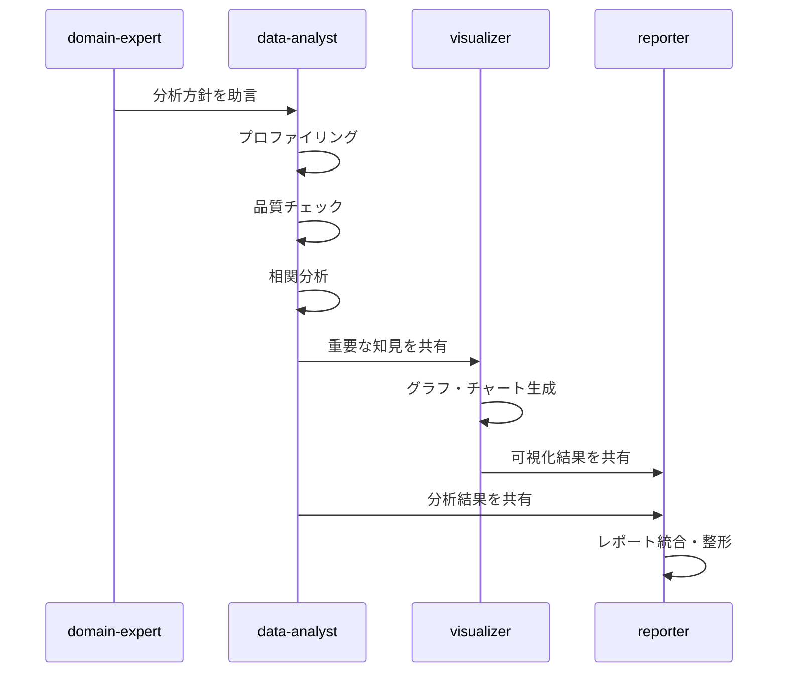

# MultiAgentAnalytics

Claude Code環境を前提としたマルチエージェントデータ分析プラットフォーム。
`edatool`（CLI + Python API）を通じて、複数の専門エージェントが協調してデータ分析を実行する。

## Features

| 機能 | 説明 |
|------|------|
| **データ分析** | プロファイリング、統計分析、相関分析、品質チェック |
| **可視化** | ヒストグラム、散布図、相関ヒートマップ |
| **分析レシピ** | 再利用可能な定型分析パターン（A/Bテスト等） |
| **データカタログ** | データセット登録、分析履歴の蓄積、横断検索・比較 |
| **パイプライン** | JSON定義の分析ワークフロー、依存管理、再実行 |
| **マルチエージェント** | 専門エージェント群による協調分析 |

## Quick Start

このリポジトリは **Claude Code 上で使うことを前提** に設計されている。
リポジトリのルートで Claude Code を起動し、自然言語やスラッシュコマンドで分析を指示する。

### 1. セットアップ

```bash
git clone https://github.com/jum-matsukuma/MultiAgentAnalytics.git
cd MultiAgentAnalytics
uv sync
```

### 2. スラッシュコマンドで分析（推奨）

Claude Code 上でそのまま入力する。

```
/analyze data/titanic/train.csv
```

自動でデータ概要の把握 → 品質チェック → 主要カラムの可視化 → レポート生成 が実行され、`output/` にMarkdownレポートが出力される。

ディレクトリを指定すると、中のデータファイルをすべて分析する:

```
/analyze data/titanic/
```

より深い分析が必要な場合は、マルチエージェントによる深層分析:

```
/analyze-deep data/titanic/train.csv
```

domain-expert → data-analyst → visualizer → reporter の4エージェントが協調し、ドメイン理解・詳細分析・可視化・レポート統合を自動実行する。

### 3. 自然言語で依頼

スラッシュコマンドを使わず、テキストで直接依頼しても同様の分析ができる:

```
このCSVファイルを分析して: data/titanic/train.csv
```

Claude Code が edatool の CLI/Python API とエージェントを自動的に活用し、分析を実行する。
より具体的な指示も可能:

```
data/titanic/train.csv の性別による生存率の差をA/Bテストで検証して
```

```
data/titanic/ ディレクトリのデータを全て分析して、train と test の違いを比較して
```

### 4. その他のスラッシュコマンド

| コマンド | 説明 |
|---------|------|
| `/analyze <file\|dir>` | クイック分析（概要 + 品質 + 可視化 + レポート） |
| `/analyze-deep <file\|dir>` | マルチエージェント深層分析 |
| `/review` | コードレビュー |
| `/test` | テスト自動生成 |
| `/pr` | ブランチ作成 → コミット → PR作成を一括実行 |
| `/docs` | ドキュメント生成 |
| `/turn-main` | mainブランチに切り替え + 最新pull |

## edatool CLI

### データ分析

```bash
uv run edatool summarize <file>                          # 概要（軽量）
uv run edatool profile <file>                            # フルプロファイル
uv run edatool correlations <file> [--target col]        # 相関分析
uv run edatool quality-check <file>                      # 品質チェック
```

### 可視化

```bash
uv run edatool plot histogram <file> --column <col> -o <out.png>
uv run edatool plot scatter <file> --x <col1> --y <col2> -o <out.png>
uv run edatool plot heatmap <file> -o <out.png>
```

### 分析レシピ

テスト済みの再利用可能な分析パターン。

```bash
uv run edatool recipe list                               # レシピ一覧
uv run edatool recipe info ab-test                       # レシピ詳細
uv run edatool recipe run ab-test <file> \               # レシピ実行
  -p group=variant -p metric=revenue \
  -p control=A -p treatment=B
```

**組み込みレシピ:**

| レシピ | 説明 |
|--------|------|
| `ab-test` | A/Bテスト分析（t検定/z検定、Cohen's d、信頼区間） |

### データカタログ

データセットと分析履歴を管理・蓄積する。

```bash
uv run edatool catalog register data/train.csv \         # データセット登録
  --name titanic --tags "kaggle,titanic"
uv run edatool catalog list                              # 一覧
uv run edatool catalog search "titanic"                  # 検索
uv run edatool catalog show titanic                      # 詳細表示
uv run edatool catalog compare train test                # 2データセット比較
uv run edatool catalog record titanic \                  # 分析結果の記録
  --analysis-type profile --findings "女性の生存率が高い"
uv run edatool catalog check-freshness                   # ファイル変更検出
```

### パイプライン

JSON定義の分析ワークフローを保存・再実行する。

```bash
uv run edatool pipeline init -t basic-eda \              # テンプレートから生成
  -o pipelines/my_eda.json
uv run edatool pipeline info pipelines/my_eda.json       # パイプライン情報
uv run edatool pipeline run pipelines/my_eda.json \      # 実行
  -p data_file=data/train.csv
uv run edatool pipeline run pipelines/my_eda.json \      # ドライラン
  -p data_file=data/train.csv --dry-run
uv run edatool pipeline run pipelines/my_eda.json \      # 途中から再実行
  -p data_file=data/train.csv --from-step heatmap
```

**組み込みテンプレート:**

| テンプレート | 説明 |
|-------------|------|
| `basic-eda` | 品質チェック + プロファイル + 相関分析 + ヒートマップ |
| `quality-monitor` | データ品質モニタリング |

### 共通オプション

```bash
--format markdown    # 出力形式: markdown（デフォルト）または json
--format json
-o <file>            # ファイルに保存（省略時はstdout）
```

## Multi-Agent Architecture

Claude Codeの専門エージェントが協調してデータ分析を実行する。

### 分析エージェント

| エージェント | 役割 |
|---|---|
| `domain-expert` | データ概要を見て分析方針を助言 |
| `data-analyst` | プロファイリング・統計分析・品質チェック |
| `visualizer` | グラフ・チャート生成 |
| `reporter` | 分析結果・グラフをレポートに統合 |

### 分析ワークフロー



### 汎用エージェント

| エージェント | 用途 |
|---|---|
| `team-lead` | チームオーケストレーター |
| `backend-dev` | バックエンド開発 |
| `qa-tester` | テスト・QA |
| `code-reviewer` | コードレビュー |

## Project Structure

```
src/edatool/
├── cli.py              # CLIエントリーポイント
├── core/               # 型定義・設定
├── io/                 # データ読込（CSV, Parquet, Excel, JSON）
├── analysis/           # 分析モジュール（stats, profiler, correlation, quality）
├── viz/                # 可視化（histogram, scatter, heatmap）
├── reporting/          # Markdownレポート生成
├── recipes/            # 分析レシピ（A/Bテスト等）
├── catalog/            # データカタログ・分析履歴
└── pipeline/           # パイプライン定義・実行エンジン

.claude/
├── agents/             # エージェント定義
└── skills/             # スキル・ドメイン知識
```

## Development

```bash
uv sync --extra dev              # 開発依存インストール
uv run python -m pytest          # テスト実行
uv run python -m ruff check      # リント
uv run python -m black .         # フォーマット
uv run python -m mypy .          # 型チェック
```

## Tech Stack

- **Python 3.11+**
- **Polars** - メインのDataFrameライブラリ
- **Matplotlib / Seaborn / Plotly** - 可視化
- **Typer** - CLI フレームワーク
- **Claude Code** - マルチエージェント実行環境
