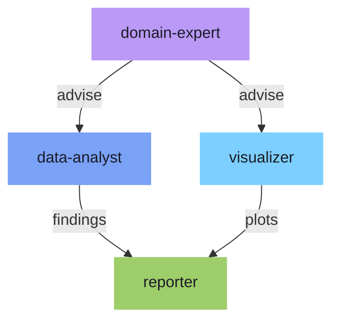
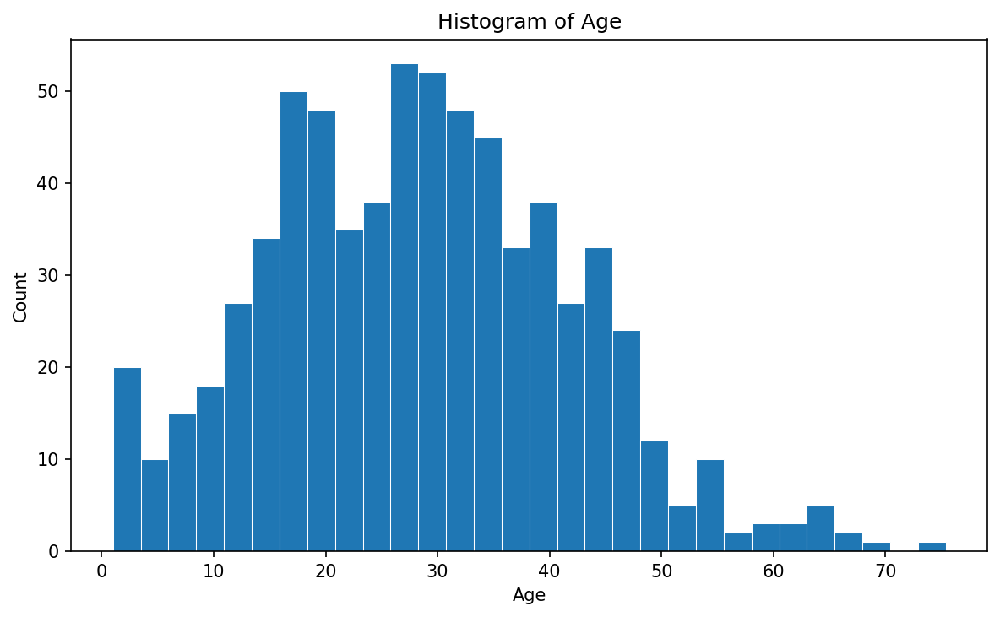
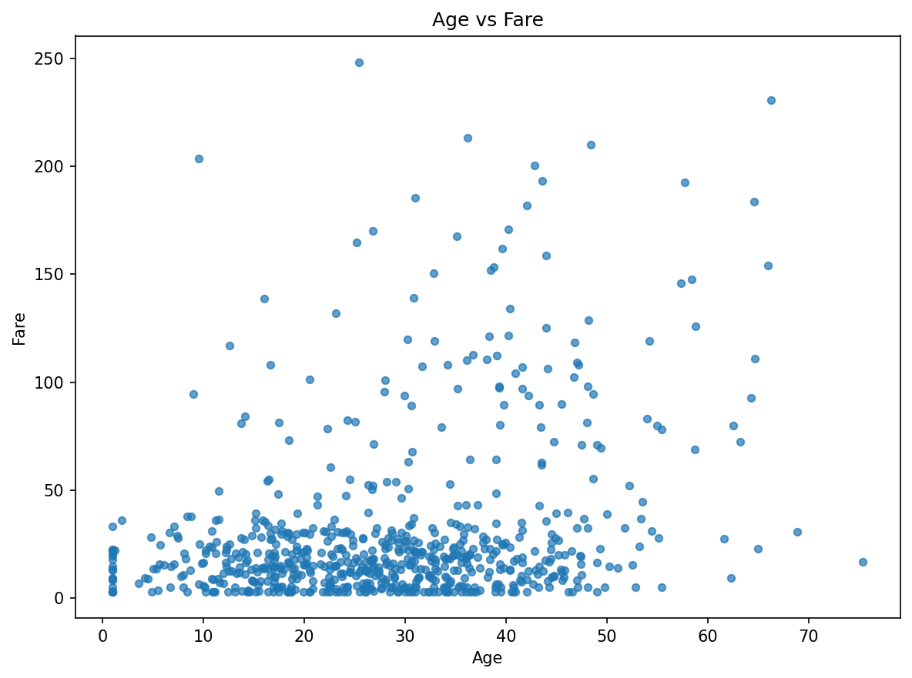
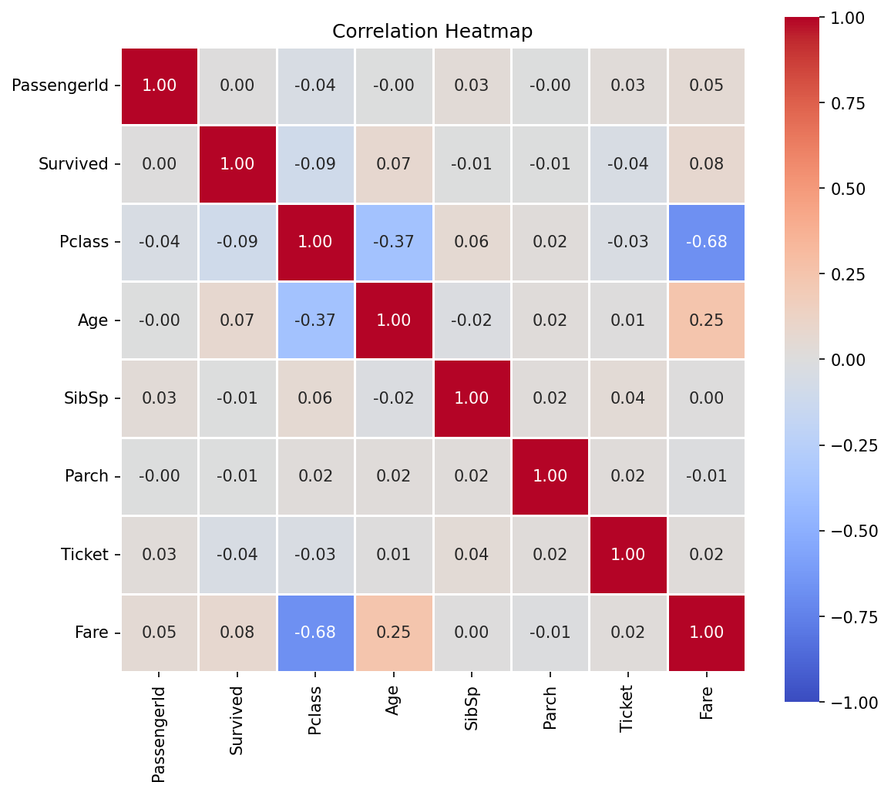

<div align="center">

# MultiAgentAnalytics

**Claude Code + Multi-Agent Data Analysis Platform**

*Speak to your data. Let specialized AI agents do the rest.*

[](https://python.org)
[](https://pola.rs)
[](https://claude.ai)

</div>

<br>

<p align="center">
  
</p>

<br>

## How It Works

Type a slash command or natural language. Four specialized agents collaborate automatically:

```
/analyze-deep data/titanic/train.csv
```



Output: a comprehensive Markdown report with statistics, quality checks, and visualizations in `output/`.

---

## Quick Start

```bash
git clone https://github.com/jum-matsukuma/MultiAgentAnalytics.git
cd MultiAgentAnalytics
uv sync
```

Open Claude Code in the repo root and start analyzing:

```
/analyze data/titanic/train.csv
```

That's it. The agents handle everything from profiling to visualization to report generation.

---

## Visualization Examples

Generated automatically from `data/titanic/train.csv` via `edatool`:

<table>
<tr>
<td align="center"><strong>Age Distribution</strong></td>
<td align="center"><strong>Age vs Fare</strong></td>
</tr>
<tr>
<td></td>
<td></td>
</tr>
<tr>
<td align="center" colspan="2"><strong>Correlation Heatmap</strong></td>
</tr>
<tr>
<td colspan="2" align="center"></td>
</tr>
</table>

---

## Commands

### Slash Commands (in Claude Code)

| Command | Description |
|---------|-------------|
| `/analyze <paths...>` | Quick analysis: profiling + quality + visualization + report |
| `/analyze-deep <paths...>` | Deep multi-agent analysis with domain expert guidance |
| `/review` | Code review |
| `/test` | Auto-generate tests |
| `/pr` | Create branch, commit, and PR in one step |
| `/docs` | Generate documentation |

Pass a single file, multiple files, or a directory:

```
/analyze data/titanic/train.csv                    # single file
/analyze data/titanic/train.csv data/titanic/test.csv   # multiple files
/analyze data/titanic/                             # entire directory
```

### edatool CLI

```bash
# Analysis
uv run edatool summarize <file>                    # Quick summary
uv run edatool profile <file>                      # Full profile
uv run edatool correlations <file> [--target col]  # Correlation analysis
uv run edatool quality-check <file>                # Quality check

# Visualization
uv run edatool plot histogram <file> --column <col> -o <out.png>
uv run edatool plot scatter <file> --x <col1> --y <col2> -o <out.png>
uv run edatool plot heatmap <file> -o <out.png>

# Recipes
uv run edatool recipe run ab-test <file> \
  -p group=variant -p metric=revenue \
  -p control=A -p treatment=B

# Data Catalog
uv run edatool catalog register data/train.csv --name titanic --tags "kaggle"
uv run edatool catalog list
uv run edatool catalog compare train test

# Pipelines
uv run edatool pipeline init -t basic-eda -o pipelines/my_eda.json
uv run edatool pipeline run pipelines/my_eda.json -p data_file=data/train.csv
```

---

## Agent Architecture

### Analysis Agents

| Agent | Role |
|-------|------|
| `domain-expert` | Identifies domain context and advises analysis direction |
| `data-analyst` | Full profiling, statistics, correlation, quality checks |
| `visualizer` | Generates charts and plots |
| `reporter` | Integrates all findings into a structured report |

### Development Agents

| Agent | Role |
|-------|------|
| `team-lead` | Orchestrates multi-agent workflows |
| `backend-dev` | Backend development |
| `qa-tester` | Testing and QA |
| `code-reviewer` | Code review |

---

## Project Structure

```
src/edatool/
├── cli.py              # CLI entry point
├── core/               # Type definitions, config
├── io/                 # Data loading (CSV, Parquet, Excel, JSON)
├── analysis/           # Stats, profiler, correlation, quality
├── viz/                # Histogram, scatter, heatmap
├── reporting/          # Markdown report generation
├── recipes/            # Reusable analysis patterns (A/B test, etc.)
├── catalog/            # Data catalog & analysis history
└── pipeline/           # Pipeline definition & execution engine

.claude/
├── agents/             # Agent definitions
└── skills/             # Skills & domain knowledge
```

## Development

```bash
uv sync --extra dev              # Install dev dependencies
uv run python -m pytest          # Tests
uv run python -m ruff check      # Lint
uv run python -m black .         # Format
uv run python -m mypy .          # Type check
```

## Tech Stack

**Python 3.11+** / **Polars** / **Matplotlib** / **Seaborn** / **Typer** / **Claude Code**
