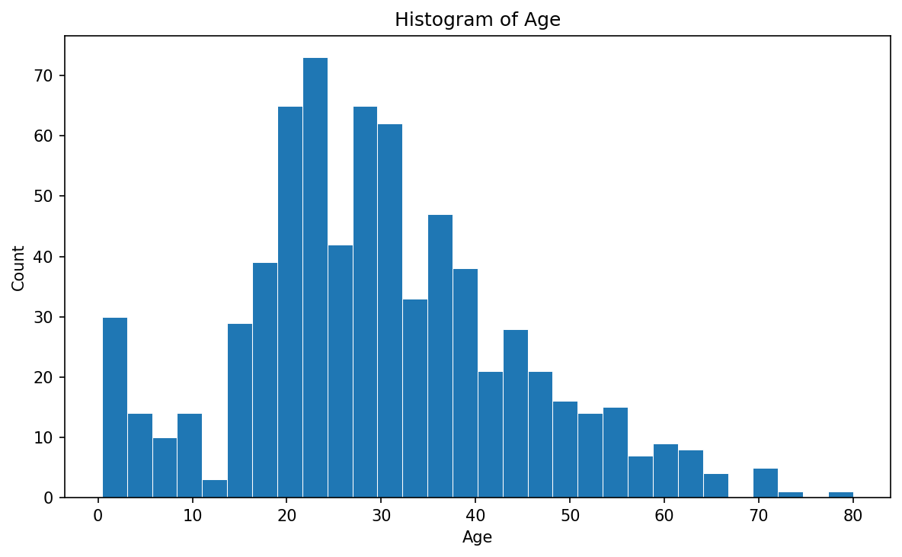
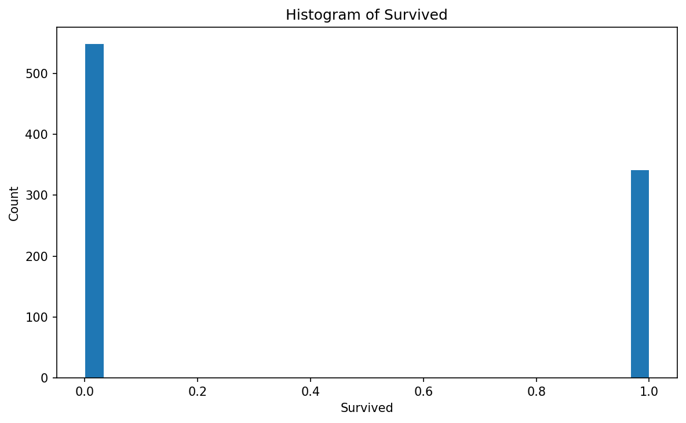
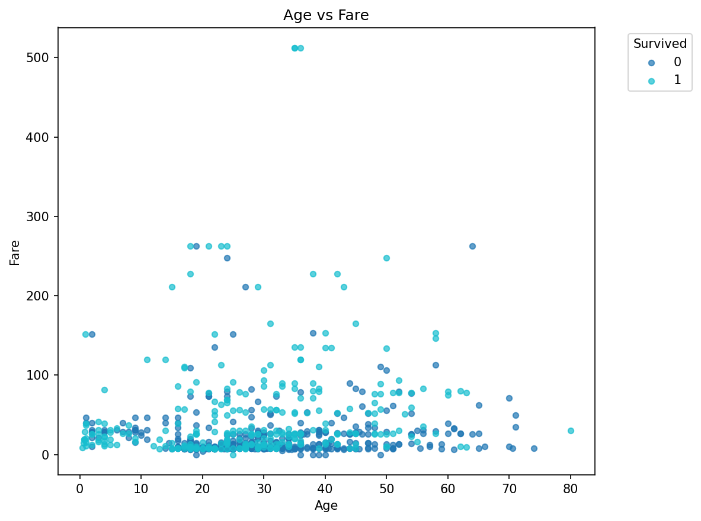
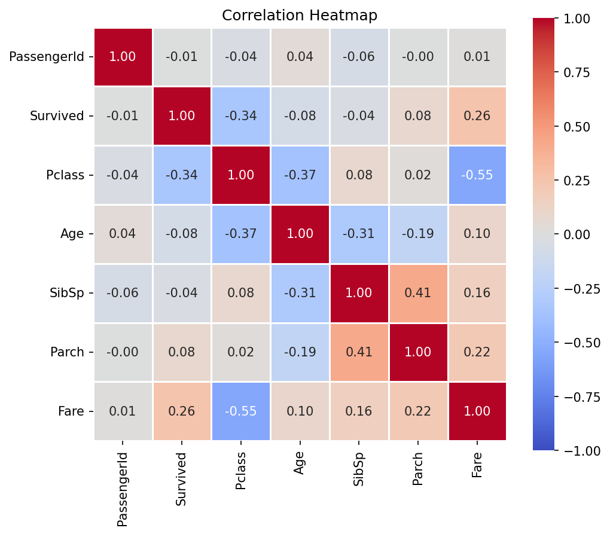

# edatool チュートリアル: Titanic データセットの分析

このチュートリアルでは、edatool の CLI と Python API を使って Titanic データセットを分析する一連の流れを紹介します。

> **前提**: `uv sync` で依存関係がインストール済みであること

---

## 1. データの概要を把握する

まず `summarize` で全体像を把握します。これはトークン効率の高い軽量コマンドで、エージェントが最初に実行するステップです。

```bash
uv run edatool summarize data/titanic/train.csv
```

出力:

```
## Dataset Summary
- **Shape**: 891 rows × 12 columns
- **Memory**: 0.1 MB

### Columns
| # | Column | Type | Nulls | Null% | Unique | Mean | Std | Min | Max |
|---|--------|------|------:|------:|-------:|-----:|----:|----:|----:|
| 1 | PassengerId | Int64 | 0 | 0.0% | 891 | 446.00 | 257.35 | 1.00 | 891.00 |
| 2 | Survived | Int64 | 0 | 0.0% | 2 | 0.38 | 0.49 | 0.00 | 1.00 |
| 3 | Pclass | Int64 | 0 | 0.0% | 3 | 2.31 | 0.84 | 1.00 | 3.00 |
| 4 | Name | String | 0 | 0.0% | 891 | - | - | - | - |
| 5 | Sex | String | 0 | 0.0% | 2 | - | - | - | - |
| 6 | Age | Float64 | 177 | 19.9% | 89 | 29.70 | 14.53 | 0.42 | 80.00 |
| 7 | SibSp | Int64 | 0 | 0.0% | 7 | 0.52 | 1.10 | 0.00 | 8.00 |
| 8 | Parch | Int64 | 0 | 0.0% | 7 | 0.38 | 0.81 | 0.00 | 6.00 |
| 9 | Ticket | String | 0 | 0.0% | 681 | - | - | - | - |
| 10 | Fare | Float64 | 0 | 0.0% | 248 | 32.20 | 49.69 | 0.00 | 512.33 |
| 11 | Cabin | String | 687 | 77.1% | 148 | - | - | - | - |
| 12 | Embarked | String | 2 | 0.2% | 4 | - | - | - | - |
```

**すぐに分かること**:
- 891人の乗客データ、12カラム
- 生存率は約38%（Survived の Mean = 0.38）
- Age に 19.9% の欠損、Cabin は 77.1% が欠損
- Fare の最大値 512.33 は平均 32.20 に対して極端に大きい（外れ値の可能性）

---

## 2. データ品質をチェックする

```bash
uv run edatool quality-check data/titanic/train.csv
```

出力:

```
## Data Quality Report
- **Total rows**: 891
- **Duplicate rows**: 0
- **Issues found**: 5

### Issues
| Severity | Category | Column | Description |
|----------|----------|--------|-------------|
| warning | missing | Age | 177 missing values (19.9%) |
| error | missing | Cabin | 687 missing values (77.1%) |
| info | missing | Embarked | 2 missing values (0.2%) |
| info | high_cardinality | PassengerId | 891 unique values (100.0%) — may be an ID column |
| info | high_cardinality | Name | 891 unique values (100.0%) — may be an ID column |
```

**発見**:
- **Cabin は 77.1% 欠損**（error レベル）→ そのままでは使いにくい。欠損自体を特徴量にする（有/無）のが定石
- **Age は 19.9% 欠損**（warning レベル）→ 中央値や回帰で補完が必要
- **重複行なし** → データはクリーン
- **PassengerId, Name は ID 列** → 分析対象外

---

## 3. 相関分析

ターゲット変数（Survived）との相関を調べます。

```bash
uv run edatool correlations data/titanic/train.csv --target Survived
```

出力（抜粋）:

```
### Correlation Matrix
| | Survived | Pclass | Age | SibSp | Parch | Fare |
|---|---:|---:|---:|---:|---:|---:|
| Survived | 1.00 | -0.34 | -0.08 | -0.04 | 0.08 | 0.26 |
| Pclass | -0.34 | 1.00 | -0.37 | 0.08 | 0.02 | -0.55 |
| Fare | 0.26 | -0.55 | 0.10 | 0.16 | 0.22 | 1.00 |
```

**Survived との相関**:
| 特徴量 | 相関係数 | 解釈 |
|---|---:|---|
| Pclass | -0.34 | 1等客ほど生存率が高い（最も強い相関） |
| Fare | +0.26 | 運賃が高いほど生存率が高い |
| Parch | +0.08 | 親子連れはやや有利 |
| Age | -0.08 | 年齢との関係は弱い |
| SibSp | -0.04 | 兄弟配偶者数はほぼ無関係 |

> **注意**: Sex（性別）は文字列型のため相関行列に含まれません。Titanicでは「女性・子供優先」が生存率に最も大きな影響を与えた特徴量です。

---

## 4. 可視化

### 年齢分布

```bash
uv run edatool plot histogram data/titanic/train.csv --column Age -o plot_hist_age.png
```



20〜30代にピークがあり、右に緩やかな裾を持つ分布。

### 生存/死亡の割合

```bash
uv run edatool plot histogram data/titanic/train.csv --column Survived -o plot_hist_survived.png
```



死亡（0）が約62%、生存（1）が約38%。不均衡なクラス分布。

### 年齢 × 運賃の散布図（生存で色分け）

```bash
uv run edatool plot scatter data/titanic/train.csv --x Age --y Fare --color Survived -o plot_scatter_age_fare.png
```



高運賃の若年層に生存者が多い傾向が見える。

### 相関ヒートマップ

```bash
uv run edatool plot heatmap data/titanic/train.csv -o plot_heatmap.png
```



Pclass と Fare の強い負の相関（-0.55）が目立つ。

---

## 5. フルプロファイル（一括実行）

上記の分析をすべてまとめて実行し、レポートファイルに保存できます。

```bash
uv run edatool profile data/titanic/train.csv -o titanic_report.md
```

JSON で出力すれば、プログラムから解析できます:

```bash
uv run edatool profile data/titanic/train.csv --format json -o titanic_report.json
```

---

## 6. Python API で使う

Jupyter Notebook やスクリプトからも同じ機能を利用できます。

```python
import edatool
import polars as pl

# データ読込
df = pl.read_csv("data/titanic/train.csv")

# 概要
summary = edatool.summarize(df)
print(summary.to_markdown())

# フルプロファイル
report = edatool.profile(df)

# Markdown で保存
with open("titanic_report.md", "w") as f:
    f.write(report.to_markdown())

# dict として取得（プログラム的に利用）
data = report.to_dict()
print(f"生存率: {data['summary']['columns'][1]['mean']:.1%}")
print(f"品質問題: {data['quality']['issue_count']}件")

# 可視化
edatool.plot.histogram(df, column="Age", output="plot_age.png")
edatool.plot.scatter(df, x="Age", y="Fare", color="Survived", output="plot_scatter.png")
edatool.plot.heatmap(df, output="plot_heatmap.png")
```

---

## 7. マルチエージェントで分析する

edatool の真価は、Claude Code の Agent Teams と組み合わせた時に発揮されます。

```
ユーザー: 「data/titanic/train.csv を分析して、レポートを作成して」

→ team-lead が以下のエージェントを起動:

  1. domain-expert:
     「Titanic データセットは生存予測が目的。
      Sex, Pclass, Age が重要な特徴量。
      "女性・子供優先" のドメイン知識を考慮すべき。」

  2. data-analyst:
     edatool summarize → profile → quality-check → correlations
     → analysis_titanic.md を作成

  3. visualizer:
     edatool plot histogram/scatter/heatmap
     → plot_*.png を生成

  4. reporter:
     分析結果 + グラフ → report_titanic.md を作成
```

エージェント定義は `.claude/agents/` にあり、ワークフローは `.claude/skills/analysis-workflow/SKILL.md` に記載されています。

---

## まとめ

| コマンド | 用途 | 所要時間 |
|---|---|---|
| `edatool summarize` | 全体像の把握 | < 1秒 |
| `edatool quality-check` | 品質問題の特定 | < 1秒 |
| `edatool correlations` | 特徴量間の関係 | < 1秒 |
| `edatool profile` | 上記すべてを一括 | < 1秒 |
| `edatool plot *` | 可視化 | 1-2秒 |

edatool は**速い・シンプル・LLMフレンドリー**を設計思想としています。Markdown出力により、Claude Code が分析結果を直接読み取って次のアクションを判断できます。
